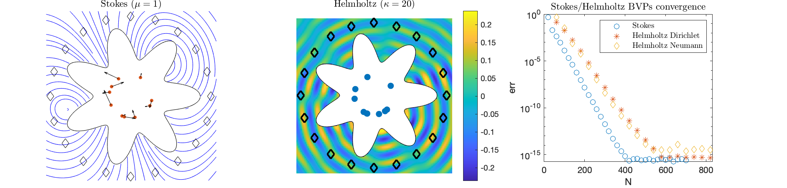

# High-order locally corrected trapezoidal rule for boundary integral operators in 2D

This is the MATLAB code for the "zeta-corrected quadrature" accompanying the paper: 

* B. Wu and P.G. Martinsson, Zeta Correction: A New Approach to Constructing Corrected Trapezoidal Rules for Singular Integral Operators. (2020, arxiv)

It contains corrected trapezoidal rules that are stable and high-order accurate for the Laplace, Helmholtz and Stokes layer potentials on smooth closed curves.

Author: Bowei Wu, 2020/7

- Also contain supporting functions modified from Alex Barnett's [BIE2D](https://github.com/ahbarnett/BIE2D) package

- See also the related [ZetaTrap3D](https://github.com/bobbielf2/ZetaTrap3D) code for surface integrals.

### Note on dependency:

Zeta corrections of the following orders use precomputed weights:  `2,4,6,8,10,16,32,40,42`. (They correspond to inputs `k =1,2,3,4,5,8,16,20,21` to the `kapur_rokhlin_sep_log.m` function.) For corrections of arbitrary orders, the `vpa` function from Symbolic Math Toolbox is required. (The test files in this repository don't require the Symbolic Toolbox.)

### Example

Here are some example outputs from the test files solving Stokes and Helmholtz exterior boundary value problems using high-order zeta quadratures. Convergence is shown again the number of points used on the boundary.

   

### Description of the main test files:

* `test_sto2d_bie.m` : solution of the Stokes Dirichlet problem exterior to a closed curve. This routine contains a convergence test.
* `test_helm2d_bie.m`  : solution of the Helmholtz Dirichlet and Neumann problems exterior to a closed curve. This routine contains convergence tests.

Supporting functions:

* `kapur_rokhlin_sep_log.m` : Use the "zeta connection" to compute the correction weights of the "separable" Kapur-Rokhlin quadrature. (see Table 7 of [Kapur and Rokhlin (1997)](https://doi.org/10.1137/S0036142995287847))
* `LapSLPslef.m`: construct matrix or give values associated with Laplace single-layer potential using native quadratures. Self-interaction is evaluated using the zeta-corrected quadrature.
* `HelmSLP.m`, `HelmDLP.m`, `HelmSLPn` : construct matrices or give values associated with Helmholtz layer potentials using native quadratures. Self-interactions are evaluated using the zeta-corrected quadrature.
* `setupquad.m`, `StoSLP.m`, `StoDLP.m` are (modified) functions from [BIE2D](https://github.com/ahbarnett/BIE2D)

